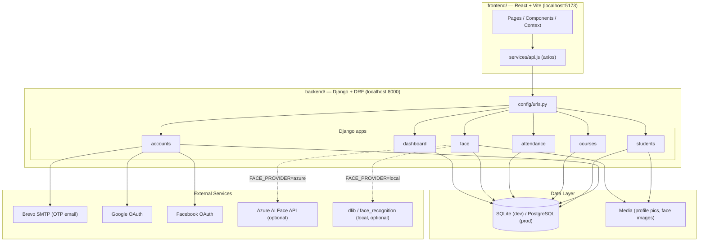
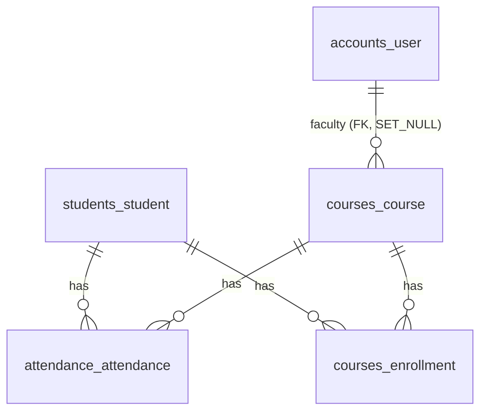
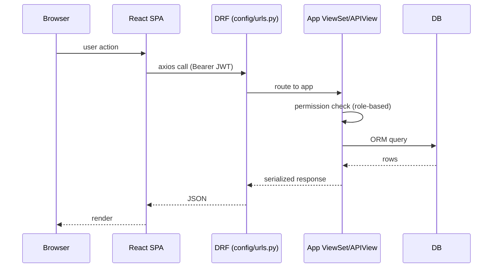
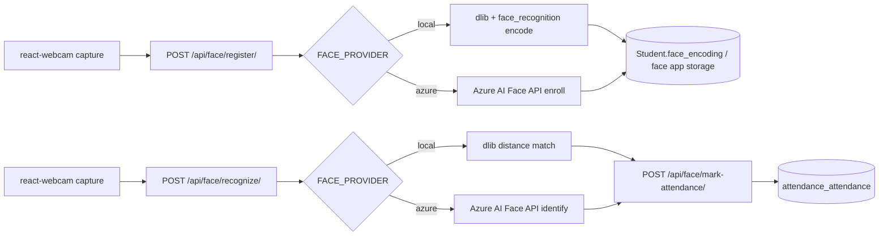

# Architecture — Attendance Management System

> **Purpose:** Explains *how* AMS is built — system layout, request flow, data flow, deployment topology.
> **Scope:** Backend, frontend, infra. For *what*/*why*, see [prd.md](prd.md).
> **Last updated:** 2026-07-26 · **Version:** 1.0
>
> This document supersedes and consolidates `docs/system-architecture.md` (kept for its Mermaid diagrams/SVG exports, which are still accurate for the core flow but predate the `face`/`dashboard` apps — treat *this* file as current).

## Table of Contents

- [High-Level Overview](#high-level-overview)
- [Technology Stack](#technology-stack)
- [Backend Architecture](#backend-architecture)
- [Frontend Architecture](#frontend-architecture)
- [Folder Structure](#folder-structure)
- [Data Model](#data-model)
- [Request Flow](#request-flow)
- [Authentication Flow](#authentication-flow)
- [Face Recognition Flow](#face-recognition-flow)
- [Deployment Architecture](#deployment-architecture)
- [Coding Patterns & Conventions](#coding-patterns--conventions)

## High-Level Overview



## Technology Stack

| Layer | Choice | Rationale |
|---|---|---|
| Backend framework | Django 5.x + Django REST Framework | Batteries-included ORM, admin panel, fast CRUD via ViewSets/routers |
| Auth | `djangorestframework-simplejwt` | Stateless JWT (1-day access / 7-day refresh), integrates with DRF permission classes |
| Database | SQLite (dev) → PostgreSQL (prod, via `DATABASE_URL`) | Zero-config local dev, scalable managed Postgres in prod |
| Config | `python-decouple` + `.env` | No secrets in source; same settings module works dev/CI/prod |
| Face recognition | `dlib-bin` + `face_recognition` (local) **or** Azure AI Face API (`azure`) | Local is free/offline; Azure is the fallback where `dlib` can't build |
| Reports | `reportlab` | PDF export for attendance reports |
| Static files | WhiteNoise | Serves Django static assets without a separate web server/CDN |
| Frontend framework | React 19 + Vite | Fast dev server, modern React (no Next.js — pure SPA, calls the DRF API) |
| Frontend HTTP client | axios (`src/services/api.js`) | Centralized API layer (see [rules.md](rules.md)) |
| Charts | chart.js + react-chartjs-2 | Dashboard visualizations |
| Face capture (browser) | react-webcam | Captures frames for face registration/recognition |
| CI/CD | GitLab CI (`.gitlab-ci.yml`) — primary; GitHub Actions (`.github/workflows/ci.yml`) — test-only mirror | GitLab drives the actual Azure deploy; GitHub is for team visibility/PRs (see [deployment.md](deployment.md)) |
| Hosting | Azure App Service (backend) + Azure Storage static website (frontend) | Low-cost, matches team's Azure familiarity |

## Backend Architecture

Django project `config/` (settings/urls/wsgi/asgi) with six apps, each following the same internal shape:

```
<app>/
├── models.py       # ORM models
├── serializers.py  # DRF serializers (validation + (de)serialization)
├── views.py        # ViewSets / APIViews (business logic entry point)
├── urls.py         # app-local routing, included from config/urls.py
├── admin.py         # Django admin registration
├── apps.py
├── migrations/
└── tests.py
```

| App | Responsibility |
|---|---|
| `accounts` | Custom `User` model (`AbstractUser` + `role`), registration, JWT login, email OTP verification, Google/Facebook social login, admin user management |
| `students` | Student CRUD, face-encoding storage |
| `courses` | Course CRUD, faculty assignment, `Enrollment` (student↔course link) |
| `attendance` | Attendance CRUD, bulk marking, attendance codes, reports, CSV/PDF export |
| `face` | Face registration/recognition — pluggable provider (`face/providers.py`) |
| `dashboard` | Read-only aggregation endpoints: program/section breakdowns, stats, at-risk detection, chronic latecomers, faculty performance, master-data import |

Routing (`config/urls.py`) mounts each app under `/api/<app>/`, except `courses` which mounts at `/api/` directly (so `Course` and `Enrollment` routes both live under `/api/`). See [api.md](api.md) for the full endpoint list.

## Frontend Architecture

```
frontend/src/
├── App.jsx                # Route table
├── main.jsx                # Entry point
├── context/                 # AuthContext (JWT/session), NotificationContext (toasts)
├── layouts/                 # DashboardLayout (shared chrome for authenticated pages)
├── pages/                   # One component per route (Login, Register, Dashboard, Students, Courses, Attendance, AttendanceCodes, Enrollments, Reports, FaceRecognition, StudentDashboard, VerifyEmail)
├── components/               # Shared/reusable pieces (e.g. SocialLogin)
├── services/api.js           # Centralized axios instance — all HTTP calls go through here
└── styles/                   # Plain CSS, one file per feature area
```

- **Routing**: `react-router-dom`, route table in `App.jsx`.
- **State**: React Context for cross-cutting concerns (auth session, notifications); local component state otherwise — no Redux/Zustand.
- **API access**: all requests go through `services/api.js` (axios instance with base URL from `VITE_API_URL` and auth header injection) — pages never call `fetch`/`axios` directly (see [rules.md](rules.md)).
- **Styling**: plain CSS files per page/feature, no CSS-in-JS, no component framework (despite early planning docs mentioning MUI — the shipped frontend does not use it).

## Folder Structure

```
ams/
├── backend/
│   ├── accounts/ students/ courses/ attendance/ face/ dashboard/   # Django apps
│   ├── config/                # settings, urls, wsgi/asgi
│   ├── scripts/                # GitLab CI variable helpers (inventory/push/stage)
│   ├── manage.py
│   ├── requirements.txt
│   └── .env.example
├── frontend/
│   ├── src/                   # see Frontend Architecture above
│   ├── public/
│   ├── package.json
│   └── .env.example
├── docs/                       # this documentation set
├── Guidelines/                  # course-deliverable planning docs (historical — see memory.md)
├── wireframes/                   # static HTML wireframes
├── .github/workflows/            # GitHub Actions (test-only mirror)
├── .gitlab-ci.yml                 # primary CI/CD (test → build → deploy)
└── package.json                   # root dev-runner (concurrently starts both servers)
```

## Data Model

Five tables, no ORM cross-app FK cycles:



- `accounts_user` — custom user, `role` ∈ {admin, faculty, student}.
- `students_student` — **not FK-linked to `accounts_user`**; a student's login account and their `Student` record are independent today (see [decisions.md](decisions.md) if this changes).
- `courses_course` — `faculty` FK to `accounts_user` (`SET_NULL`, limited to `role='faculty'`).
- `courses_enrollment` — unique `(student, course)`; the source of truth for who can be marked attendance in a course.
- `attendance_attendance` — unique `(student, course, date)`; `AttendanceSerializer.validate()` and `mark_bulk` both reject/skip non-enrolled students.

Full field-level schema: [`docs/database-schema.md`](database-schema.md) (still accurate for these 5 tables; does not yet cover `face`/`dashboard` app models — check `backend/face/models.py` and `backend/dashboard/models.py` directly for those).

## Request Flow



## Authentication Flow

1. `POST /api/auth/register/` — create user (or `google/`/`facebook/` for social sign-in).
2. Email OTP: `POST /api/auth/otp/send/` → Brevo SMTP → `POST /api/auth/otp/verify/`.
3. `POST /api/auth/login/` (SimpleJWT `TokenObtainPairView`) → access (1 day) + refresh (7 days) tokens.
4. Client stores tokens, sends `Authorization: Bearer <access>` on every request.
5. `POST /api/auth/token/refresh/` when access token expires.
6. `GET /api/auth/me/` — resolve current user/role for the frontend's `AuthContext`.

Role-based permissions are enforced per-view (DRF permission classes), not centrally — admin/faculty get write access to Students/Courses/Attendance; students get read-only access to their own data.

## Face Recognition Flow



`FACE_PROVIDER` (env var, default `local`) selects the implementation in `backend/face/providers.py`. `local` needs no network call but requires `dlib`/`face_recognition` installed (not always possible on constrained hosts — see [`Guidelines/REALITY_CHECK.md`](../Guidelines/REALITY_CHECK.md) "Build Requirements" section). `azure` calls the Azure AI Face API using `AZURE_FACE_ENDPOINT`/`AZURE_FACE_KEY`/`AZURE_FACE_PERSON_GROUP`.

## Deployment Architecture

See [deployment.md](deployment.md) for full detail. Summary: GitLab CI tests every push/MR; on `main`, it builds the frontend and deploys backend → Azure App Service (`ams-backend`), frontend static build → Azure Storage static website (`amsfrontendweb`).

## Coding Patterns & Conventions

See [rules.md](rules.md) for the enforceable rule set. Key patterns already in use:

- **Backend**: one Django app per bounded domain concept; DRF `ViewSet` + `DefaultRouter` for full-CRUD resources, plain `APIView`/function-based views for actions that aren't resource CRUD (auth, OTP, face, dashboard aggregations).
- **Frontend**: one page component per route, shared chrome in `layouts/`, all network I/O funneled through `services/api.js`.
- **Config**: every environment-specific value goes through `python-decouple`/`import.meta.env`, never hardcoded — see both `.env.example` files.
