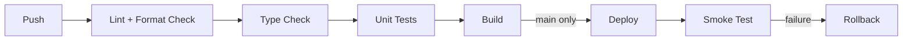

# CI/CD Design — Attendance Management System

> **Purpose:** The target CI/CD pipeline shape — quality gates, stages, and how they should evolve. For the pipelines as they exist today (what actually runs, why two CI configs, the async-deploy workaround), see [deployment.md](deployment.md) — that's the operational doc; this is the design/target doc.
> **Scope:** `.gitlab-ci.yml`, `.github/workflows/ci.yml`, and future pipeline additions (frontend tests, mobile CI).
> **Last updated:** 2026-07-26 · **Version:** 1.0

## Table of Contents

- [Current State](#current-state)
- [Target Pipeline Stages](#target-pipeline-stages)
- [Linting & Formatting](#linting--formatting)
- [Type Checking](#type-checking)
- [Testing](#testing)
- [Build](#build)
- [Containerization](#containerization)
- [Deployment](#deployment)
- [Rollback](#rollback)
- [Notifications](#notifications)
- [Environment Promotion](#environment-promotion)
- [Version Tagging](#version-tagging)

## Current State

Per [deployment.md](deployment.md): GitLab CI runs `test → build-frontend/deploy-backend → deploy-frontend` on `main`, and `test` on `develop`/every MR. GitHub Actions mirrors the `test` stage only, for team visibility. No lint/format/type-check step runs in either pipeline today; no frontend test step exists (no test suite exists yet — [testing.md](testing.md)); no Docker build; no automated rollback; no notifications.

## Target Pipeline Stages

Add stages in this order (lint first — fastest feedback, cheapest to run) — don't add all of these in one PR; each is a separate, reviewable pipeline change per [phases.md](phases.md).

## Linting & Formatting

- **Backend**: `ruff` (lint + format in one tool) — not yet configured, see [rules.md](rules.md)/[tech-stack.md](tech-stack.md). Add as a CI step that runs on every push/MR, before tests (fail fast).
- **Frontend**: ESLint already configured, not yet run in CI — add `npm run lint` as a CI step. Prettier (`.prettierrc`) is configured but not enforced — add `npx prettier --check .` once the existing codebase has been run through `prettier --write` once (a first Prettier pass on an unformatted codebase is its own reviewed PR, not bundled into "add the CI check").

## Type Checking

- **Backend**: Python has no static type checker configured (no `mypy`/`pyright`). Not currently recommended to add retroactively across an untyped codebase — reconsider if new code starts using type hints consistently.
- **Frontend**: plain JS (`.jsx`), no TypeScript, so no type-check step applies today. **Planned**: `packages/*` (see [package-guidelines.md](package-guidelines.md)) will be TypeScript from the start — `tsc --noEmit` as a CI step applies to those packages once they exist, and to the web/mobile apps if/when they migrate to TS.

## Testing

- Backend: `manage.py makemigrations --check`, `manage.py check`, `manage.py test` — already enforced ([testing.md](testing.md)).
- Frontend: no test step yet (no suite exists) — add once Vitest is stood up ([testing.md](testing.md) Atomic Tasks).
- Coverage reporting: not yet wired in — add as a non-blocking report first (visibility before enforcement), matching the same phased approach as [security-standards.md](security-standards.md) dependency scanning.

## Build

- Backend: no separate "build" step — Oryx builds the Python app at deploy time on Azure App Service ([deployment.md](deployment.md)).
- Frontend: `npm ci && npm run build` — already in place, runs on `main` only. **Recommendation**: run the build check (not the deploy) on every PR/MR too, not just `main` — catches build-breaking changes before merge instead of after.

## Containerization

Not currently used — Azure App Service's Oryx build path is the deploy mechanism, no Docker image is built ([tech-stack.md](tech-stack.md)). Don't add Docker speculatively; reconsider only if a second deploy target requiring container parity becomes a real need (e.g., local dev environment parity across a growing team, or a future non-Azure host).

## Deployment

Current: GitLab CI, `main`-only, `az webapp deploy --async` (backend) + `az storage blob upload-batch` (frontend). See [deployment.md](deployment.md) for the async-deploy rationale (Azure front-door timeout on synchronous deploys). No change recommended here — the async pattern is a considered workaround for a real platform constraint, not a shortcut.

## Rollback

No automated rollback pipeline exists today ([deployment.md](deployment.md) Rollback Plan — manual: redeploy a prior Azure deployment slot, or revert-and-redeploy via git). **Recommendation, not yet implemented**: a manual-trigger GitLab CI job that redeploys the previous successful backend zip/frontend build without requiring a git revert — reduces rollback time from "revert commit, wait for full pipeline" to "click redeploy." Scope as a [phases.md](phases.md) task; not urgent given current low deploy frequency and small user base.

## Notifications

Not currently configured — pipeline success/failure is only visible by checking GitLab/GitHub directly. **Recommendation**: a Slack/email/Teams webhook on pipeline failure (not success — success-spam trains people to ignore notifications) once the team has a shared channel for it; low priority for a small team already watching both remotes.

## Environment Promotion

Two real environments today: local dev and production (`main` deploys directly to prod on every merge — no staging tier). **Recommendation, evaluate need before implementing**: introduce a staging environment (a second Azure App Service slot or a separate low-cost resource) only if production incidents from unverified `main` merges become a real, recurring problem — for the current team size and deploy cadence, `develop` (tested but not deployed) plus careful `main` merges may be sufficient; adding a staging tier is real ongoing cost (a second environment to keep in sync, seed, and monitor) that should be justified by evidence, not added preemptively.

## Version Tagging

Not currently used — deploys happen on every `main` merge with no version tag/release artifact. **Recommendation**: adopt semantic version tags on `main` at meaningful milestones (see [versioning.md](versioning.md)) so a specific deployed state can be referenced later ("what was live when this bug was reported") — doesn't need to gate every deploy, can be applied retroactively/periodically rather than on every single merge.
