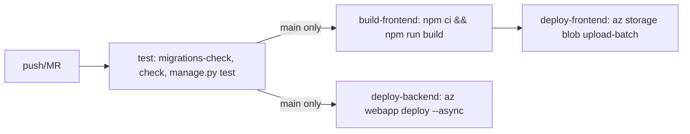

# Deployment — Attendance Management System

> **Purpose:** How AMS is built, tested, and deployed — dev, CI, and production.
> **Scope:** `.gitlab-ci.yml`, `.github/workflows/ci.yml`, Azure config (`.deployment`, `backend/.deployment`, `backend/postbuild.sh`, `backend/startup.sh`).
> **Last updated:** 2026-08-04 · **Version:** 1.1

## Table of Contents

- [Environments](#environments)
- [Development Environment](#development-environment)
- [CI/CD Pipeline](#cicd-pipeline)
- [Why Two CI Configs](#why-two-ci-configs)
- [Environment Variables](#environment-variables)
- [Production Deployment](#production-deployment)
- [Deployment Checklist](#deployment-checklist)
- [Rollback Plan](#rollback-plan)
- [Monitoring & Logging](#monitoring--logging)
- [Credential Inventory & Deployment Continuity](#credential-inventory--deployment-continuity)

## Environments

| Environment | Backend | Frontend | Database |
|---|---|---|---|
| Local dev | `python manage.py runserver` → `localhost:8000` | `npm run dev` → `localhost:5173` | SQLite |
| CI (test) | Ephemeral container, `python:3.11` | `node:20` (build check only) | SQLite (in-container) |
| Production | Azure App Service `ams-backend` | Azure Storage static website `amsfrontendweb` | PostgreSQL via `DATABASE_URL` (falls back to SQLite if unset) |

## Development Environment

```bash
# Backend
cd backend
python -m venv .venv
.venv\Scripts\activate        # Windows
pip install -r requirements.txt
copy .env.example .env        # fill in SECRET_KEY at minimum
python manage.py migrate
python manage.py runserver

# Frontend
cd frontend
npm install
copy .env.example .env        # points VITE_API_URL at the backend
npm run dev
```

Or from the repo root: `npm run dev` (runs both concurrently via the root `package.json`, which assumes a `.venv-win` virtualenv — adjust `backend` script if your venv is named differently).

## CI/CD Pipeline

**GitLab CI** (`.gitlab-ci.yml`) — the pipeline that actually deploys:



- `test` stage runs on `main`, `develop`, and every merge request.
- `build-frontend`, `deploy-backend`, `deploy-frontend` only run on `main`, gated on `test` passing (`needs: [test]`).
- Backend deploy zips `backend/` and uploads via `az webapp deploy --async true` — async specifically because a synchronous deploy holds the HTTP request open while Oryx rebuilds `numpy`/`dlib-bin` (often >230s on the B1 plan), and Azure's front door cuts the request off, false-failing the job even when the deploy succeeds.
- Mail/OTP settings are synced from GitLab CI/CD masked variables into Azure App Service settings at deploy time, guarded on `EMAIL_HOST_PASSWORD` being set — if it's missing (e.g., a Protected variable unavailable on this branch), the sync is skipped rather than overwriting live settings with empty strings.

## Why Two CI Configs

`.github/workflows/ci.yml` runs the same backend test steps (migrations-check, check, test) on push/PR to `develop`, on GitHub Actions. This is intentional, not redundant config to delete: per `HANDOFF.md`, **GitHub is used for team visibility, issues, and PRs**, while **GitLab drives the actual deploy pipeline**. Both remotes (`origin` = GitHub, `gitlab` = GitLab) are kept in sync manually. Do not remove either pipeline without updating this doc and confirming with the team — GitHub Actions is the only CI signal visible to anyone only watching the GitHub repo.

## Environment Variables

See `backend/.env.example` and `frontend/.env.example` for the full, current list. Key ones:

| Variable | Purpose |
|---|---|
| `SECRET_KEY` | Django secret key — required, no default in production |
| `DEBUG` | Must be `False` in production |
| `ALLOWED_HOSTS`, `CORS_ALLOWED_ORIGINS`, `CSRF_TRUSTED_ORIGINS` | Host/origin allowlists |
| `DATABASE_URL` | If set and starts with `postgres`, switches DB engine to Postgres; otherwise SQLite |
| `EMAIL_*` | Brevo SMTP for OTP email |
| `OTP_EXPIRY_MINUTES`, `OTP_RESEND_COOLDOWN_SECONDS`, `THROTTLE_OTP_*` | OTP behavior/rate limits |
| `GOOGLE_CLIENT_ID`/`SECRET`, `FACEBOOK_APP_ID`/`SECRET` | Social sign-in |
| `FACE_PROVIDER`, `AZURE_FACE_*` | Face recognition provider selection |
| `VITE_API_URL`, `VITE_GOOGLE_CLIENT_ID`, `VITE_FACEBOOK_APP_ID` (frontend) | Frontend build-time config |

## Production Deployment

- **Host**: Azure App Service `ams-backend` (resource group `ams-rg`); Oryx builds the Python app on deploy per `.deployment`/`backend/.deployment` (`SCM_DO_BUILD_DURING_DEPLOYMENT = true`), with `backend/postbuild.sh`/`backend/startup.sh` as custom hooks.
- **Frontend**: static build uploaded to Azure Storage static website `amsfrontendweb`.
- **Static files**: WhiteNoise serves Django static assets from within the App Service; frontend assets are served directly from Azure Storage, not through Django.

## Deployment Checklist

1. Confirm `main` has a passing `test` stage before merging (CI blocks build/deploy on it already, but verify locally if bypassing is ever considered — it shouldn't be).
2. If new env vars were added, confirm they're set in Azure App Service settings (or added to the GitLab CI/CD sync block in `.gitlab-ci.yml` if they're mail/OTP-related).
3. If a new migration was added, confirm it applies cleanly (`makemigrations --check` already gates this in CI, but a manual `migrate --plan` check against prod-like data is wise for destructive schema changes).
4. After deploy, smoke-test `GET /api/auth/me/` (with a token) and `GET /` (redirects to `FRONTEND_URL`) against the live App Service URL.

## Rollback Plan

No automated rollback is configured. To roll back:

1. Azure App Service keeps prior deployment slots/history under "Deployment Center" — redeploy a prior successful zip, or
2. Revert the offending commit on `main`, push, and let the pipeline redeploy the previous good state.
3. For a bad migration, `python manage.py migrate <app> <previous_migration_name>` against the production DB (requires DB access — coordinate before running against shared Postgres).

## Monitoring & Logging

No dedicated APM/log-aggregation is configured. Azure App Service's built-in log stream (`az webapp log tail`) and Application Insights (if enabled on the resource) are the available tools today. This is a documented gap, not a hidden one — add structured logging/monitoring as a future task if the team decides it's worth the operational overhead (see [phases.md](phases.md) for where to slot it).

## Credential Inventory & Deployment Continuity

> **Why this section exists**: the project's risk register (see [memory.md](memory.md#external-trackers), risks P-01/P-02) flags that one person (Abhishek) currently holds every production credential and is the only one who has deployed or can deploy. This section is the mitigation: an inventory of *where* each credential lives and *what to do* if the primary maintainer is unavailable — without putting any actual secret value in this repo.

### Where credentials live (locations only — no values here or anywhere in git)

| Credential | Where it's stored | Used for |
|---|---|---|
| `AZURE_CLIENT_ID` / `AZURE_CLIENT_SECRET` / `AZURE_TENANT_ID` / `AZURE_SUBSCRIPTION_ID` | GitLab CI/CD → Settings → CI/CD → Variables (masked/protected) | Service principal used by `az login` in the deploy stage |
| `AZURE_RESOURCE_GROUP` / `AZURE_WEBAPP_NAME` / `AZURE_STORAGE_ACCOUNT` | Same GitLab CI/CD Variables block | Identifies which Azure resources to deploy to (not secret, but kept alongside the credentials for convenience) |
| `EMAIL_HOST_USER` / `EMAIL_HOST_PASSWORD` / `EMAIL_HOST` / `EMAIL_PORT` / `DEFAULT_FROM_EMAIL` | GitLab CI/CD Variables (synced into Azure App Service settings at deploy time — see CI/CD Pipeline above) | Brevo SMTP for OTP email |
| `SECRET_KEY`, `DATABASE_URL`, `GOOGLE_CLIENT_ID`/`SECRET`, `FACEBOOK_APP_ID`/`SECRET`, `AZURE_FACE_*` | Azure App Service `ams-backend` → Configuration → Application settings (set directly, not all synced from CI) | Django runtime config, social login, face provider |
| Azure account access itself | Azure Portal, subscription under `ams-rg` resource group | Owns everything above; access to this is the actual root credential |
| GitHub repo admin / Actions secrets | GitHub repo Settings → Secrets and variables (if any are configured beyond the public CI steps) | GitHub Actions test mirror (see Why Two CI Configs above) |
| GitLab repo/CI admin | GitLab project Settings | Owns the CI/CD Variables above and the pipeline that actually deploys |

### Backup-access runbook

If the primary maintainer is unavailable and a deploy, rollback, or credential rotation is needed:

1. **Azure Portal access**: the Azure subscription owner (check IAM role assignments on `ams-rg`) can grant a second person "Contributor" on the resource group without needing any existing credential from the primary maintainer — this is the actual disaster-recovery path, since Azure AD/Portal access is independent of anything stored in GitLab/GitHub.
2. **GitLab CI/CD Variables**: anyone with Maintainer+ role on the GitLab project can view (if unmasked) or rotate these under Settings → CI/CD → Variables. Project Owner should ensure at least one other team member has Maintainer access, not just Developer.
3. **GitHub repo**: ensure at least one other team member has Admin (not just Write) access, so branch protections, Actions secrets, and repo settings aren't single-owner.
4. **Rotation after any suspected exposure**: rotate the exposed credential at its source (Azure Portal for Azure/App Service secrets, Brevo dashboard for SMTP, Google/Facebook developer consoles for OAuth secrets), then update the GitLab CI/CD Variable and/or Azure App Service setting — never commit the new value anywhere, including chat or this repo's docs.
5. **If Azure access itself is lost**: this is the true single point of failure — there is no documented secondary owner today. Action item: add a second Azure AD user as Owner/Contributor on `ams-rg` as a standing backup, not just during an incident.

### Standing action items (from risk register P-01/P-02)

- [ ] Add a second person as Contributor (or Owner) on the `ams-rg` Azure resource group.
- [ ] Confirm at least one teammate besides Abhishek has Maintainer role on GitLab and Admin role on GitHub.
- [ ] Store a redacted list of "which variable lives where" (this section) somewhere the whole team can find it — done, here.
- [ ] Do a dry-run: have the backup person walk through steps 1–3 above without actually changing anything, to confirm the access grants work before they're needed in an emergency.
