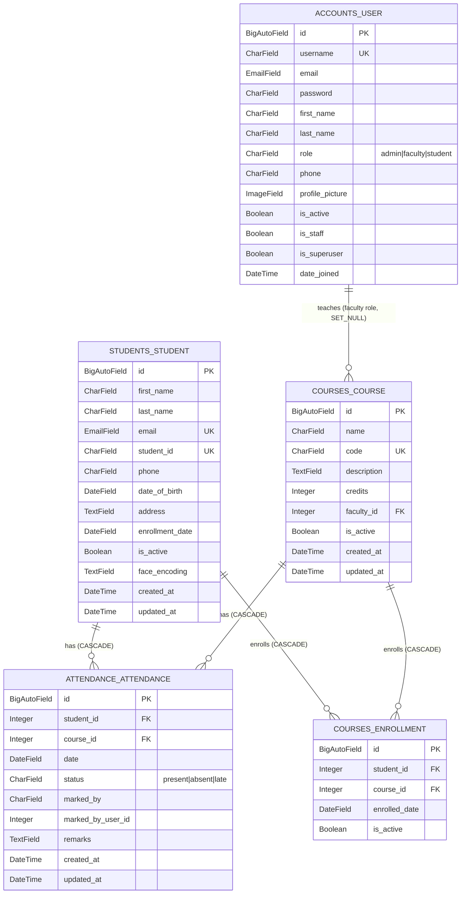

# ER Diagram — Attendance Management System

Built from verified `docs/database-schema.md` (Jul 10, Day 4). 5 tables, including `Enrollment` (added Jul 9, Day 3 — see Changelog).

## Diagram (Mermaid ERD)

Render: paste block into https://mermaid.live, or view directly on GitHub (native Mermaid support in `.md` files).

## Notes / Constraints

- `attendance_attendance` has composite unique constraint on (`student`, `course`, `date`) — one record per student per course per day. Not expressible in base Mermaid ERD notation, noted here instead.
- `accounts_user` and `students_student` are **not** FK-linked. A student-role login account and a `Student` record are independent today (unrelated to the Enrollment changelog below).
- `courses_course.faculty` → `accounts_user`, `on_delete=SET_NULL`, `limit_choices_to={role: 'faculty'}`.
- `attendance_attendance.marked_by_user_id` is a plain `IntegerField`, not an FK — stores an id only, no referential integrity.

## Changelog

- **Jul 9 (Day 3):** `courses_enrollment` table added. Composite unique constraint (`student`, `course`). Backfill migration `0003_backfill_enrollment` populated rows from existing attendance history.
- **Jul 10 (Day 4):** `AttendanceSerializer.validate()` now rejects marking attendance for unenrolled students; `AttendanceViewSet.mark_bulk` filters out non-enrolled students per record (returned in a `skipped` list).
- Not yet exposed via REST: no `/api/enrollments/` endpoint yet. Add when frontend needs it.

## Source of Truth

Cross-check target: `python manage.py inspectdb` against this diagram + `docs/database-schema.md` — listed as remaining/not yet actioned in `HANDOFF.md`. This diagram was built from model definitions as documented, not from a live `inspectdb` run.
