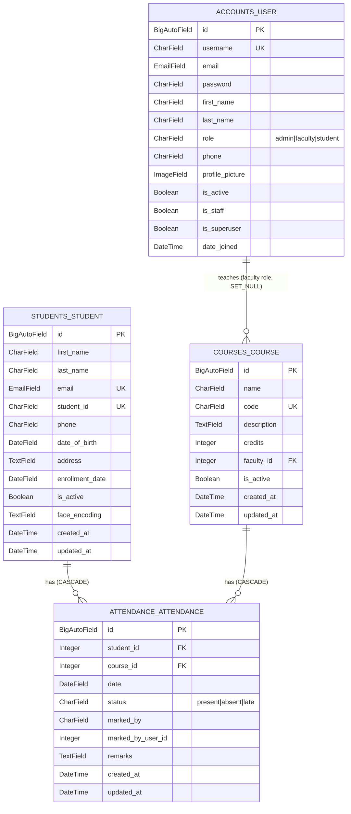

# ER Diagram — Attendance Management System

Built from verified `docs/database-schema.md` (Jul 9, Day 3). 4 tables. No `Enrollment` table — documented gap below.

## Diagram (Mermaid ERD)

Render: paste block into https://mermaid.live, or view directly on GitHub (native Mermaid support in `.md` files).

## Notes / Constraints

- `attendance_attendance` has composite unique constraint on (`student`, `course`, `date`) — one record per student per course per day. Not expressible in base Mermaid ERD notation, noted here instead.
- `accounts_user` and `students_student` are **not** FK-linked. A student-role login account and a `Student` record are independent today (see gap below).
- `courses_course.faculty` → `accounts_user`, `on_delete=SET_NULL`, `limit_choices_to={role: 'faculty'}`.
- `attendance_attendance.marked_by_user_id` is a plain `IntegerField`, not an FK — stores an id only, no referential integrity.

## Known Gap: No Enrollment Table

No `enrollment` table links students to courses. `attendance_attendance` references `student` and `course` directly, so nothing today prevents marking a student present/absent in a course they aren't enrolled in.

**Status (Jul 9, Day 3):** deferred pending team decision at kickoff meeting, not forgotten. Reserved branch if added: `feature/US-05-enrollment-decision` (Week 4, see `GIT_WORKFLOW.md` Section 7). If added later, this diagram and `docs/database-schema.md` need a matching update: new `ENROLLMENT` entity, `STUDENTS_STUDENT ||--o{ ENROLLMENT`, `COURSES_COURSE ||--o{ ENROLLMENT`, and a decision on whether `attendance_attendance` starts validating against it.

## Source of Truth

Cross-check target: `python manage.py inspectdb` against this diagram + `docs/database-schema.md` — listed as remaining/not yet actioned in `HANDOFF.md`. This diagram was built from model definitions as documented, not from a live `inspectdb` run.
