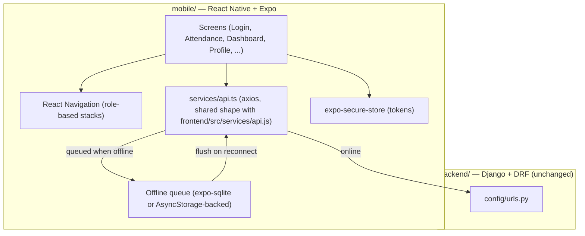

# Mobile Architecture — Attendance Management System

> **Purpose:** Explains *how* the mobile app is built — stack, project layout, navigation, offline strategy, and how it talks to the existing Django/DRF backend.
> **Scope:** Mobile Application epic (GitHub #34). See [architecture.md](architecture.md) for the web/backend architecture this reuses.
> **Last updated:** 2026-07-26 · **Version:** 1.0

## Table of Contents

- [Mobile Application Architecture](#mobile-application-architecture)
- [Technology Stack](#technology-stack)
- [Project Layout (`mobile/`)](#project-layout-mobile)
- [Navigation](#navigation)
- [API Layer](#api-layer)
- [Auth & Token Storage](#auth--token-storage)
- [Offline Queue (Attendance Marking)](#offline-queue-attendance-marking)
- [Push Notifications](#push-notifications)
- [Face Recognition on Mobile](#face-recognition-on-mobile)
- [Build & Release](#build--release)

## Mobile Application Architecture



No new backend service. The mobile app is another client of the same `/api/*` surface documented in [api.md](api.md), plus the additions tracked in [gap-analysis.md](gap-analysis.md) (mobile OAuth token exchange, push device registration).

## Technology Stack

| Layer | Choice | Rationale |
|---|---|---|
| Framework | React Native via **Expo (managed workflow)** | See [decisions.md](decisions.md) ADR-008 for the full comparison against Flutter/native/PWA |
| Language | TypeScript | Catches API-shape mismatches against the DRF backend at compile time; web frontend is JS but the team already writes typed-ish PropTypes-free React — TS is a small step, not a new paradigm |
| Navigation | `@react-navigation/native` (stack + tab navigators, role-gated) | De facto standard for Expo apps, mirrors the web's `react-router-dom` route-table mental model |
| HTTP client | axios | Same library as `frontend/src/services/api.js` — shared mental model, same interceptor pattern for auth headers/refresh |
| Local storage | `expo-secure-store` (tokens), `expo-sqlite` (offline attendance queue) | Secure store for anything auth-related (NFR-03 in [mobile-requirements.md](mobile-requirements.md)); SQLite for structured queued records over plain AsyncStorage |
| Camera | `expo-camera` | Face registration/recognition capture, replaces `react-webcam`'s role on web |
| Push | `expo-notifications` + Expo Push Service | Avoids standing up separate APNs/FCM credential management directly; revisit only if Expo's push service becomes a limitation |
| State | React Context (mirrors web's `AuthContext`/`NotificationContext` pattern) | Consistent with [rules.md](rules.md) "no Redux/Zustand" stance on web; no reason to diverge for mobile at this scale |

## Project Layout (`mobile/`)

```
mobile/
├── app.json                 # Expo config (name, icons, splash, permissions)
├── App.tsx                  # Entry point, navigation root
├── .env.example              # EXPO_PUBLIC_API_URL and friends — see NFR-05
├── src/
│   ├── navigation/            # Role-based navigator shells (student, faculty)
│   ├── screens/                # One screen per route, mirrors frontend/src/pages/ naming where the feature overlaps
│   ├── context/                 # AuthContext, NotificationContext (ports of the web versions' logic, not shared code — see note below)
│   ├── services/
│   │   ├── api.ts                # axios instance, same interceptor shape as web
│   │   └── offlineQueue.ts        # queue read/write/flush (Phase 17/22)
│   └── components/                # Shared UI pieces
└── assets/
```

**No shared npm package between `frontend/` and `mobile/` in v1.** React Native and React DOM component trees aren't interchangeable, so UI can't be shared; the *API contract* is shared implicitly by both clients targeting the same documented [api.md](api.md) surface, not by shared code. Revisit a shared `packages/api-types/` (already scoped, not implemented — see [package-guidelines.md](package-guidelines.md)) once both clients stabilize, if type drift becomes a real pain point.

## Navigation

Two top-level navigator shells, chosen at runtime after login based on `role` from `GET /api/auth/me/` (same source of truth the web `AuthContext` uses):

- **Student shell**: Attendance history, Reports, self-check-in, Profile.
- **Faculty shell**: Mark attendance (manual/face/code), Dashboard, Courses (read-mostly), Profile.

`admin` role is not given a mobile shell in v1 — see [mobile-requirements.md](mobile-requirements.md) Target Roles.

## API Layer

`services/api.ts` mirrors `frontend/src/services/api.js`: one axios instance, base URL from `EXPO_PUBLIC_API_URL` (Expo's env-var convention — must be prefixed `EXPO_PUBLIC_` to be inlined into the client bundle), request interceptor injects `Authorization: Bearer <access>`, response interceptor handles 401 → refresh-token exchange → retry once. Every screen calls through this layer, never `fetch`/`axios` directly — same rule as [rules.md](rules.md) enforces on web.

## Auth & Token Storage

- Access/refresh tokens stored in `expo-secure-store` (Keychain on iOS, Keystore on Android) — never `AsyncStorage` (unencrypted).
- Social login uses **native SDKs** (`expo-auth-session` with Google/Facebook providers), not the web's redirect-based OAuth flow — a mobile app can't share a browser session/cookie jar with the backend the way the web SPA does. This requires a backend contract addition; see [gap-analysis.md](gap-analysis.md).
- Silent re-auth on app foreground if the access token is expired but the refresh token is still valid (mirrors `AuthContext.jsx`'s mount-time check).

## Offline Queue (Attendance Marking)

Scope: **manual attendance marking only** (see [mobile-requirements.md](mobile-requirements.md) MR-10 and its Open Question). Flow:

1. Faculty marks attendance while offline → record written to local SQLite queue with a client-generated UUID and timestamp, UI shows it as "pending sync".
2. On reconnect (`NetInfo` listener), queue flushes in order against `POST /api/attendance/` / `/attendance/bulk/`.
3. Conflicts (e.g., the same student/course/date already marked by someone else in the meantime) surface the existing `400` validation error to the user for manual resolution — no automatic conflict resolution in v1.

This is the MVP scoped in Phase 17; hardening (retry/backoff, partial-batch failure UX, queue size limits) is Phase 22.

## Push Notifications

Device push tokens register against a new backend endpoint (`POST /api/notifications/devices/` — see [gap-analysis.md](gap-analysis.md) and [phases.md](phases.md) Phase 21). Sending is triggered by the same at-risk/chronic-latecomer detection logic `dashboard` already computes (see [phases.md](phases.md) Phase 7 for the web-side notification phase this piggybacks on) — no duplicate trigger logic between web notifications and mobile push.

## Face Recognition on Mobile

Reuses the existing `FACE_PROVIDER`-abstracted backend (`backend/face/providers.py`, see [architecture.md](architecture.md#face-recognition-flow)) — the mobile app just becomes another caller of `POST /api/face/register/` and `/recognize/`, submitting an `expo-camera` frame instead of a `react-webcam` frame. No new provider code needed. Always requires a live network call to the backend regardless of `local`/`azure` provider — see [mobile-requirements.md](mobile-requirements.md) Open Questions for why this isn't part of the offline queue.

## Build & Release

Covered in [phases.md](phases.md) Phase 23: Expo EAS Build for iOS/Android binaries, EAS Submit or manual store upload, and where in CI (GitHub Actions, since GitLab CI is Azure-deploy-focused and mobile builds don't deploy to Azure) a lint/typecheck stage runs — additive, does not touch `.gitlab-ci.yml` (per issue #35's own task list).
