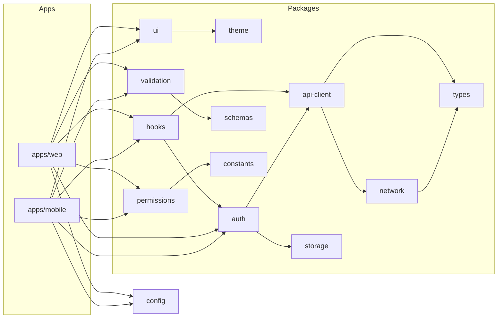

# Shared Package Guidelines — Attendance Management System

> **Purpose:** Design the `packages/` boundary for the eventual monorepo split between `apps/web`, `apps/mobile`, and `apps/backend`. **This is a design document, not an implementation status report** — none of these packages exist yet; the repo today is still `backend/` + `frontend/` at the root. Do not create these directories as a side effect of reading this doc; implementation is a separate, scoped phase (see [phases.md](phases.md)).
> **Scope:** Shared TypeScript packages consumed by Web and Mobile.
> **Last updated:** 2026-07-26 · **Version:** 1.0

## Table of Contents

- [Principles](#principles)
- [Package Map](#package-map)
- [Package Responsibilities](#package-responsibilities)
- [Dependency Direction Rules](#dependency-direction-rules)
- [What Stays Platform-Specific](#what-stays-platform-specific)
- [Migration Path](#migration-path)

## Principles

1. **A package earns its existence by having two real consumers.** Don't create `packages/x` because the target architecture lists it — create it when Web and Mobile (or Web and a second Web surface) both need the same logic. Until Mobile exists, most of these packages have exactly one consumer (Web) and can stay as plain `frontend/src/` modules.
2. **No platform-specific code in `packages/`.** If a package needs to branch on `Platform.OS` or `window`, it's not shared code — split it, or push the platform-specific part into the consuming app.
3. **No circular dependencies.** Dependency direction is one-way: `packages/*` → nothing app-specific; `apps/*` → `packages/*`. A package never imports from `apps/`.
4. **TypeScript everywhere in `packages/`** — see [tech-stack.md](tech-stack.md). Types are the contract; an untyped shared package defeats the purpose of sharing it.
5. **Backend logic is not shared via `packages/`.** Django/Python business rules stay in `backend/`; what's shared with Web/Mobile is the *contract* (types describing API shapes, validation schemas that mirror serializer rules) — not the Python implementation itself.

## Package Map

```
packages/
├── types/          # Shared TypeScript types (API request/response shapes, domain models)
├── api-client/      # Typed HTTP client wrapping the DRF API (built on packages/network)
├── validation/       # Client-side validation schemas mirroring backend serializer rules
├── schemas/            # Raw schema definitions (zod or similar) — validation and types both derive from these
├── auth/                # Token storage abstraction, refresh-token logic, auth state shape
├── permissions/           # Role/permission constants and check helpers (admin/faculty/student)
├── constants/               # Shared enums/constants (attendance status, roles, provider names)
├── config/                    # Environment/config loading contract (not secrets themselves)
├── network/                     # Low-level fetch/axios wrapper, retry/backoff, error normalization
├── storage/                       # Cross-platform key-value storage abstraction (web localStorage / mobile SecureStore)
├── theme/                           # Design tokens (color, spacing, typography) — see design.md
├── ui/                                 # Cross-platform primitive components (where React/React Native can share, e.g. via react-native-web) — expect this to be the smallest, latest-populated package
├── hooks/                                # Shared React hooks not tied to a specific UI library (e.g. useDebounce, useAuthSession)
├── utils/                                  # Pure utility functions (date formatting, string helpers) with zero side effects
└── shared/                                    # Catch-all only for things that don't yet justify their own package — audit periodically and split out, don't let it become a dumping ground
```

## Package Responsibilities

| Package | Responsibility | Depends on |
|---|---|---|
| `types` | API request/response shapes, domain model types (User, Student, Course, Attendance, etc.) mirroring backend serializers | nothing |
| `schemas` | Runtime schema definitions (recommend `zod`) that `types` and `validation` both derive from | nothing |
| `constants` | Roles, attendance statuses, face-provider names, other backend enums mirrored on the client | nothing |
| `validation` | Form/input validation built on `schemas` | `schemas`, `types` |
| `network` | Low-level HTTP wrapper: base URL config, retry/backoff, error shape normalization | `types` |
| `api-client` | Typed functions per API resource (`getStudents()`, `markAttendance()`, ...), built on `network` | `network`, `types`, `constants` |
| `auth` | Token storage interface, refresh logic, "am I logged in / what role" state shape | `api-client`, `storage`, `types` |
| `storage` | Cross-platform key-value storage interface, with a web and a mobile implementation behind the same interface | nothing (platform implementation injected by the consuming app) |
| `permissions` | Role → allowed-action checks, shared between web route guards and mobile screen guards | `constants`, `types` |
| `config` | Typed accessor for environment config (API base URL, feature flags) — not the secrets themselves, just the typed contract | nothing |
| `theme` | Design tokens: color palette, spacing scale, typography — see [design.md](design.md) | nothing |
| `hooks` | Platform-agnostic React hooks (state/data hooks, not DOM-specific ones) | `api-client`, `auth` |
| `ui` | Primitive components usable on both platforms (via `react-native-web` or a shared prop-contract pattern) — expect this to grow last, once `theme` and real duplicated UI patterns exist | `theme` |
| `utils` | Pure functions: date/time formatting, string/number helpers | nothing |
| `shared` | Temporary home for anything not yet categorized — review quarterly, split contents into a proper package or delete if unused | varies |

## Dependency Direction Rules



- Arrows point from consumer to dependency; no arrow ever points from a `packages/*` box back to `apps/*`.
- `types`, `schemas`, `constants`, `theme`, `utils`, `config`, `storage` have **zero** intra-`packages/` dependencies — they're the foundation layer. If one of these needs to import from another package in this list, that's a signal the boundary is wrong.
- Before adding a new cross-package import, check it doesn't create a cycle: run a dependency graph tool (e.g. `madge`) once real packages exist — don't rely on manual review alone as the package count grows.

## What Stays Platform-Specific

Stays in `apps/web`:
- DOM-specific code, CSS, routing (`react-router-dom`), anything using `window`/`document`.

Stays in `apps/mobile`:
- Native module usage (camera, push notifications, secure storage's native implementation), React Navigation, platform-specific styling (`StyleSheet.create`).

Stays in `apps/backend`:
- All Django/Python business logic, ORM models, migrations, serializer validation logic itself (the *schema* it enforces can be mirrored in `packages/schemas`, but the Python code is not shared).

## Migration Path

This section describes the eventual move from today's `backend/` + `frontend/` layout — it is a plan, not a status:

1. **Phase A (current)**: `frontend/src/services/api.js` is the de facto (single-consumer) equivalent of `api-client` + `network`. No extraction needed yet — Mobile doesn't exist.
2. **Phase B (mobile-foundation phase, see [phases.md](phases.md))**: when `apps/mobile` is scaffolded, extract the first genuinely-shared pieces — start with `types`, `constants`, `schemas`/`validation` (smallest, most stable, least platform-coupled) — into real `packages/` before writing any mobile screen that would otherwise duplicate them.
3. **Phase C**: extract `api-client`/`network`/`auth`/`storage`/`permissions` once mobile needs its own API calls and auth state.
4. **Phase D**: `theme`/`ui`/`hooks` last — only once there's a second real UI surface to share patterns with, and only for components that are genuinely visually/behaviorally identical across platforms (most won't be, and that's fine — see [design.md](design.md) "Web Guidelines" vs "Mobile Guidelines").
5. **Do not front-load this.** Creating all 15 packages empty before Mobile exists produces indirection with no payoff and makes the single current consumer (Web) harder to navigate for no benefit.
