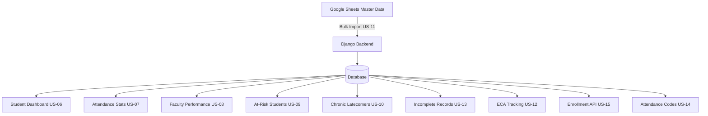

# Requirements: Dashboard & Analytics Features

**Version:** 1.0 — Jul 10, 2026
**Source:** Google Sheets Analysis (SUM I 2026 Dashboard, Student Master Dashboard, Testing_Sheet_For_Dashboard, Attendance)
**Status:** Approved — Sprint Backlog

## 1. Overview

This document captures requirements derived from existing Google Sheets dashboards used at MIT. The goal is to replicate and enhance these analytics features as REST API endpoints in the Django backend.

### 1.1 Attendance Codes

The sheets use the following attendance marking codes:

| Code | Meaning | Notes |
|------|---------|-------|
| P | Present | Student attended class |
| LP | Late Present | Student arrived late |
| A | Absent | Student did not attend |
| ECA | Extra-Curricular Activity | Student participated in ECA (counted as present) |

### 1.2 Status Thresholds

Attendance percentages map to status indicators:

| Range | Status | Indicator |
|-------|--------|-----------|
| ≥60% | GOOD | 🟢 |
| 41-59% | AVERAGE | 🟡 |
| ≤40% | CRITICAL | 🔴 |
| No Data | No Data | ⚪ |

---

## 2. Feature: Student Academic Dashboard (US-06)

### Business Need
Faculty need a quick lookup tool to view a student's complete attendance record across all enrolled subjects, similar to the Dashboard sheet.

### API Endpoints

| Method | Endpoint | Description |
|--------|----------|-------------|
| GET | `/api/dashboard/students/?search=<name>` | Search students with auto-complete |
| GET | `/api/dashboard/students/<id>/` | Full attendance breakdown by subject |
| GET | `/api/dashboard/programs/` | List all programs |
| GET | `/api/dashboard/sections/?program=<program>` | List sections for a program |

### Response Shape — Student Detail

```json
{
  "id": 1,
  "name": "Aditya Shrestha",
  "program": "BBA",
  "section": "BBA FALL 2024 A",
  "subjects": [
    {
      "subject": "COM 100 Introduction to Mass Communication",
      "faculty": "Kosh Raj Koirala",
      "classes_run": 30,
      "total_present": 14,
      "total_absent": 16,
      "total_late": 0,
      "total_eca": 0,
      "attendance_pct": 46.7,
      "status": "🟡 AVERAGE"
    }
  ]
}
```

### Acceptance Criteria
1. Search returns students matching name with program/section auto-fill
2. Detail view shows all enrolled subjects with full attendance breakdown
3. Attendance % = (present + eca) / classes_run
4. Color-coded status per subject

---

## 3. Feature: Attendance Statistics Overview (US-07)

### Business Need
Program coordinators need a subject-level overview of attendance across all sections, matching the 📊 Attendance Stats sheet.

### API Endpoints

| Method | Endpoint | Description |
|--------|----------|-------------|
| GET | `/api/dashboard/stats/` | Subject-level attendance stats |
| GET | `/api/dashboard/stats/?program=BIT&section=BIT+FALL+2024+C` | Filtered |

### Response Shape

```json
{
  "stats": [
    {
      "program": "BIT",
      "section": "BIT FALL 2024 C",
      "subject": "CSE 210 Operating System",
      "faculty": "Sugat Man Shakya",
      "classes_run": 32,
      "enrolled": 32,
      "marked": 32,
      "avg_headcount": 25,
      "worst_day": 16,
      "overall_att_pct": 78.7,
      "status": "🟢 GOOD"
    }
  ]
}
```

### Acceptance Criteria
1. Lists every (program, section, subject) combination
2. Shows enrolled count, marked count, average daily headcount, worst day
3. Calculates Overall Att % = Avg Daily Headcount / Enrolled
4. Filterable by program and section

---

## 4. Feature: Faculty Performance Dashboard (US-08)

### Business Need
Administrators need to see which faculty have the best/worst classroom engagement, matching the 👨‍🏫 Faculty Performance sheet.

### API Endpoints

| Method | Endpoint | Description |
|--------|----------|-------------|
| GET | `/api/dashboard/faculty-performance/` | Faculty ranked by attendance |
| GET | `/api/dashboard/faculty-performance/?ordering=att_pct` | Sort options |

### Response Shape

```json
{
  "faculty": [
    {
      "name": "Dilip Adhikari",
      "subjects": 1,
      "students_managed": 33,
      "avg_students_present": 29,
      "overall_att_pct": 87.7,
      "worst_subject": "Public Speaking",
      "worst_subject_pct": 87.7
    }
  ]
}
```

### Acceptance Criteria
1. Faculty ranked by overall attendance percentage
2. Shows subject count, students managed, avg headcount
3. Identifies each faculty's worst-performing subject
4. Sortable by name, subjects, att_pct

---

## 5. Feature: At-Risk Student Detection (US-09)

### Business Need
Faculty need automated flagging of students with attendance <60% in any subject, matching the 📉 At-Risk Students sheet.

### API Endpoints

| Method | Endpoint | Description |
|--------|----------|-------------|
| GET | `/api/dashboard/at-risk/` | Students with <60% attendance |
| GET | `/api/dashboard/at-risk/?threshold=75` | Custom threshold |

### Response Shape

```json
{
  "students": [
    {
      "program": "BIT",
      "section": "BIT FALL 2024 D",
      "subject": "CSE 215 Data Structure and Algorithms",
      "present": 0,
      "run": 9,
      "att_pct": 0,
      "student_name": "Ishwar Rasaili",
      "rating": "🔴 POOR"
    }
  ]
}
```

### Acceptance Criteria
1. Flags students below threshold (default 60%) in ANY subject
2. Per-subject breakdown with present/run counts
3. Deduplicated — one entry per student per failing subject
4. Ordered by attendance % ascending
5. Custom threshold via query param

---

## 6. Feature: Chronic Latecomers Detection (US-10)

### Business Need
Faculty need to identify students with 3+ late marks, matching the 🕒 Chronic Latecomers sheet.

### API Endpoints

| Method | Endpoint | Description |
|--------|----------|-------------|
| GET | `/api/dashboard/chronic-latecomers/` | Students with 3+ lates |
| GET | `/api/dashboard/chronic-latecomers/?threshold=5` | Custom threshold |

### Response Shape

```json
{
  "students": [
    {
      "program": "BIT",
      "section": "BIT SPRING 2026 C26",
      "subject_breakdown": {
        "Computer Applications": {"lp": 22, "run": 32},
        "Public Speaking": {"lp": 4, "run": 30}
      },
      "student_name": "Sarjan Hamal Thakuri",
      "total_lp": 26,
      "status": "⚠️ CONTINUOUS STREAK"
    }
  ]
}
```

### Acceptance Criteria
1. Flags students with 3+ LP marks (default) in any subject
2. Per-subject breakdown shown
3. Combined total LP across subjects
4. Ordered by total LP descending
5. Custom threshold via query param

---

## 7. Feature: Master Data Bulk Import (US-11)

### Business Need
Admin needs to bulk import the 1800+ row Master Data sheet into the system.

### API Endpoints

| Method | Endpoint | Description |
|--------|----------|-------------|
| POST | `/api/dashboard/master-data/import/` | Import JSON array |
| POST | `/api/dashboard/master-data/import/?dry_run=true` | Validate only |

### Expected Input Columns
Program, Section, Subject, Student Name, Faculty, Time, Room, Classes Run, Total Present, Total Absent, Total Late, Total ECA, Absent Reasons / Notes

### Acceptance Criteria
1. Accepts JSON array matching Master Data columns
2. Creates/updates Courses, Students, Enrollments, Faculty Users, Attendance records
3. Reports: created_count, updated_count, skipped_count, errors
4. Dry-run mode for validation only

---

## 8. Feature: ECA Tracking (US-12)

### Business Need
Students participate in sports, clubs, and other activities — these should count as attendance credit.

### API Endpoints

| Method | Endpoint | Description |
|--------|----------|-------------|
| GET/POST | `/api/eca/` | List and create ECA records |
| GET/PUT/DELETE | `/api/eca/<id>/` | CRUD for single record |

### Design Decision
Add `eca_count` IntegerField to Attendance model, or create separate ECAModel. Preferred: add to Attendance model with status='ECA'.

### Acceptance Criteria
1. Faculty can record ECA for students
2. ECA counts toward attendance in stats
3. Included in student dashboard and attendance stats responses

---

## 9. Feature: Incomplete Records Detection (US-13)

### Business Need
Administrators need to detect subjects/courses with missing attendance data, matching the ⚠️ Incomplete Records sheet.

### API Endpoints

| Method | Endpoint | Description |
|--------|----------|-------------|
| GET | `/api/dashboard/incomplete-records/` | Subjects with data issues |

### Detection Rules
- 🚨 NO DATA: subject has 0 attendance records (classes_run = 0)
- ⚠️ INCOMPLETE: marked_count < enrolled_count

### Acceptance Criteria
1. Returns subjects with data issues
2. Clear remarks explaining the issue
3. Filterable by program

---

## 10. Feature: Attendance Key Configuration (US-14)

### Business Need
The Attendance sheet has a configurable key (P/L/E/U). The system should allow custom attendance codes.

### API Endpoints

| Method | Endpoint | Description |
|--------|----------|-------------|
| GET | `/api/attendance-codes/` | List active codes |
| POST/PUT/DELETE | (admin only) | CRUD for codes |

### Model Design
New model `AttendanceCode`: code (CharField), label (CharField), description, is_active

### Acceptance Criteria
1. Configurable attendance codes via DB model
2. Admin CRUD interface
3. API returns active codes for frontend
4. Attendance model status choices extended or made dynamic

---

## 11. Feature: Enrollment REST Endpoint (US-15)

### Business Need
Enrollment model exists but has no REST API — frontend cannot manage enrollments.

### API Endpoints

| Method | Endpoint | Description |
|--------|----------|-------------|
| GET/POST | `/api/enrollments/` | List and create |
| GET/PUT/DELETE | `/api/enrollments/<id>/` | Single enrollment CRUD |

### Acceptance Criteria
1. Full CRUD for enrollment records
2. Filter by student, course, is_active
3. Nested serializer with student name and course code+name
4. Faculty/Admin can CRUD; Students view own only

---

## Appendix: Data Flow



## Appendix: Sprint Priority

| Priority | US | Feature | Effort | Dependencies |
|----------|----|---------|--------|-------------|
| P0 | US-06 | Student Dashboard | Medium | None |
| P0 | US-07 | Attendance Stats | Medium | None |
| P0 | US-15 | Enrollment API | Small | None |
| P1 | US-08 | Faculty Performance | Medium | US-07 |
| P1 | US-09 | At-Risk Detection | Small | US-07 |
| P1 | US-10 | Chronic Latecomers | Small | US-07 |
| P1 | US-13 | Incomplete Records | Small | US-07 |
| P2 | US-12 | ECA Tracking | Small | None |
| P2 | US-11 | Master Data Import | Large | US-15 |
| P2 | US-14 | Attendance Codes | Small | None |
