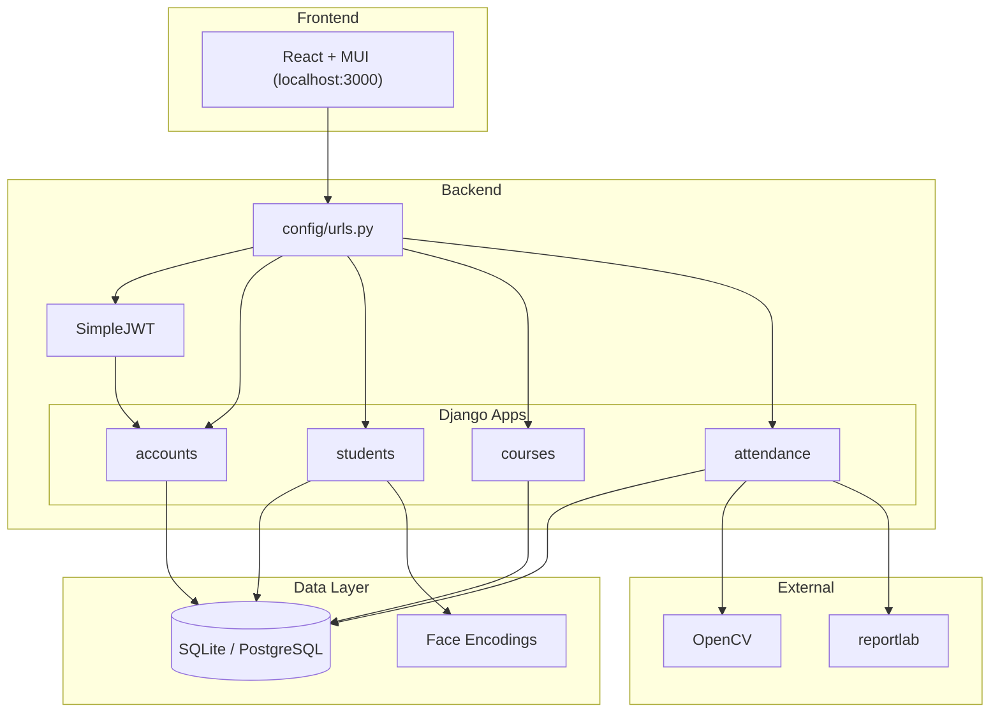
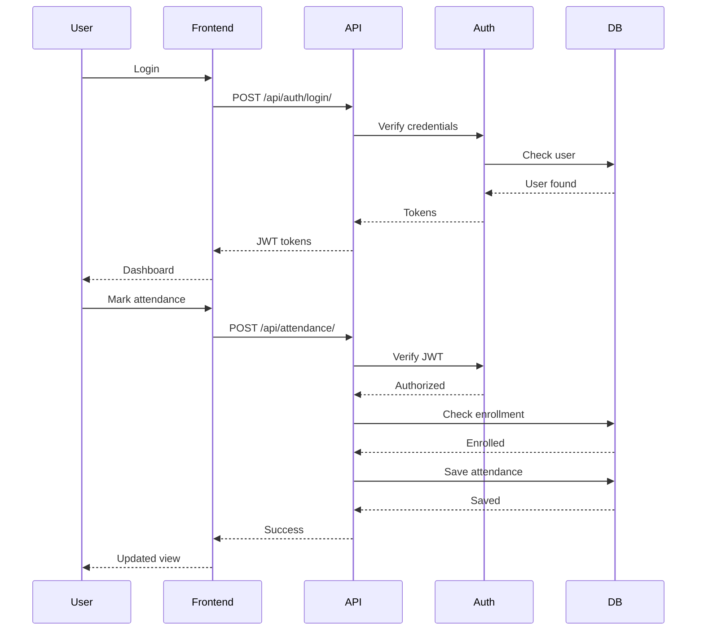
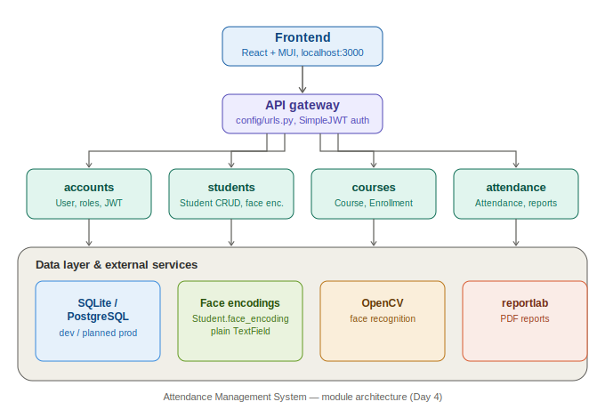
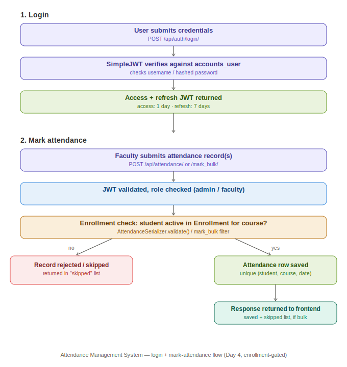

# System Architecture — Attendance Management System

_Generated Jul 10 (Day 4), documents what actually exists in the repo._

> **Note:** The Mermaid diagrams below render automatically on GitHub. Standalone SVG exports are also kept in `docs/` for use outside GitHub (slides, reports, printed docs) — see below.





## Stack

| Layer | Actual Choice | Why |
|---|---|---|
| Frontend | React + Vite + MUI (local, not yet in repo) | Ekata's dev environment, `http://localhost:3000` |
| Backend | Django 5.2.16 + Django REST Framework | full-featured ORM, admin panel, fast CRUD via viewsets |
| Database | SQLite (dev) → PostgreSQL (planned prod) | zero-config dev, scalable prod |
| Face recognition | OpenCV (`opencv-python`, `opencv-contrib-python`) | already installed, encoding stored on `Student.face_encoding` |
| Auth | SimpleJWT (djangorestframework-simplejwt) | access token 1 day, refresh 7 days, integrated with DRF |
| Reports | reportlab | PDF export for attendance reports |
| Config | python-decouple + `.env` | SECRET_KEY/DEBUG/ALLOWED_HOSTS/CORS pulled from env, not hardcoded |

## Django Apps

| App | Purpose |
|---|---|
| `accounts` | Custom `User` (AbstractUser) with `role` field (admin/faculty/student), registration, JWT login, profile |
| `students` | Student CRUD, face encoding storage |
| `courses` | Course CRUD, faculty assignment, Enrollment (student↔course link) |
| `attendance` | Attendance marking (single + bulk), reports, enrollment-gated |

## API Endpoints

| Method | Endpoint | Auth | Description |
|---|---|---|---|
| POST | `/api/auth/register/` | AllowAny | Register new user |
| POST | `/api/auth/login/` | AllowAny | JWT token obtain (SimpleJWT `TokenObtainPairView`) |
| POST | `/api/auth/token/refresh/` | AllowAny | Refresh JWT token |
| GET | `/api/auth/me/` | IsAuthenticated | Current user profile |
| GET/POST | `/api/students/` | IsAuthenticated (list) / Admin,Faculty (create) | Student CRUD (DRF router) |
| GET/PUT/DELETE | `/api/students/:id/` | IsAuthenticated (read) / Admin,Faculty (write) | Student detail |
| GET/POST | `/api/courses/` | IsAuthenticated (list) / Admin,Faculty (create) | Course CRUD (DRF router) |
| GET/PUT/DELETE | `/api/courses/:id/` | IsAuthenticated (read) / Admin,Faculty (write) | Course detail |
| GET/POST | `/api/attendance/` | IsAuthenticated (list) / Admin,Faculty (create) | Attendance CRUD, now enrollment-checked (see below) |
| GET/PUT/DELETE | `/api/attendance/:id/` | IsAuthenticated (read) / Admin,Faculty (write) | Attendance detail |
| POST | `/api/attendance/mark_bulk/` | Admin,Faculty | Bulk mark; skips + reports any student not enrolled in the course |
| GET | `/api/attendance/my_attendance/?student_id=` | IsAuthenticated | Student's own attendance |
| GET | `/api/attendance/report/?course=&student=&start_date=&end_date=` | Admin,Faculty | Attendance stats |
| GET | `/admin/` | Staff | Django admin |

Routing: `config/urls.py` mounts each app under `/api/<app>/` via `include()`. `students`, `courses`, `attendance` use DRF `DefaultRouter` (full CRUD + custom `@action` routes). `accounts` uses explicit `path()` entries since it's auth, not a resource CRUD.

**Gap:** `Enrollment` has no REST endpoint yet — it's managed via Django admin / shell only. Enforcement lives in `AttendanceSerializer.validate()` and the `mark_bulk` view, not exposed for direct CRUD.

## Enrollment Enforcement (added Day 4)

- `AttendanceSerializer.validate()` rejects marking attendance for a student not in an active `Enrollment` for that course.
- `AttendanceViewSet.mark_bulk` filters bulk records against the course's enrolled-student set; non-enrolled students are skipped and returned in a `skipped` list with a reason, rather than failing the whole batch.

## Diagram Assets

- **System Architecture Design** — `docs/architecture.svg` — standalone export of the component diagram above, for use outside GitHub (reports, slides).

  

- **Attendance Workflow** — `docs/attendance-flow.svg` — standalone export of the attendance-marking flow, expands on the sequence diagram above with the full user-facing workflow.

  

## Folder Structure

```
attendance-management-system/
├── config/              # project settings, root urls, wsgi/asgi
│   ├── settings.py      # SECRET_KEY/DEBUG/ALLOWED_HOSTS/CORS via .env (python-decouple)
│   └── urls.py          # mounts accounts/students/courses/attendance under /api/
├── accounts/            # custom User model, register/login/me
├── students/            # Student CRUD, face_encoding field
├── courses/             # Course CRUD + Enrollment model
├── attendance/          # Attendance CRUD, mark_bulk, report, my_attendance
├── docs/                # architecture + schema docs (this file lives here)
├── manage.py
├── requirements.txt
├── .env                 # gitignored, SECRET_KEY etc.
└── db.sqlite3            # dev database
```

## Security Config (confirmed in place)

- `SECRET_KEY`, `DEBUG`, `ALLOWED_HOSTS`, `CORS_ALLOWED_ORIGINS` all load from `.env` via `python-decouple` — no hardcoded secrets in `settings.py`.
- `CORS_ALLOWED_ORIGINS` restricted to `http://localhost:3000,http://127.0.0.1:3000`.

## Known Open Items

- No Enrollment REST endpoint (admin/shell only).
- No CI/CD or deployment config exists yet.
