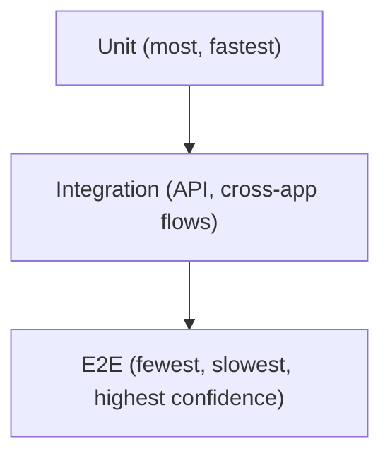

# Testing Strategy — Enterprise Scope

> **Purpose:** The target testing strategy across all test types (unit through security/accessibility) for AMS as it grows into a Web + Mobile + Backend monorepo. For what's actually implemented and how to run it today, see [testing.md](testing.md) — that doc is current-state; this doc is the target shape and where each gap is tracked.
> **Scope:** Backend, Web, Mobile (planned).
> **Last updated:** 2026-07-26 · **Version:** 1.0

## Table of Contents

- [Testing Pyramid](#testing-pyramid)
- [Unit Testing](#unit-testing)
- [Integration Testing](#integration-testing)
- [API Testing](#api-testing)
- [End-to-End Testing](#end-to-end-testing)
- [Web Testing](#web-testing)
- [Mobile Testing (Planned)](#mobile-testing-planned)
- [Performance & Load Testing](#performance--load-testing)
- [Security Testing](#security-testing)
- [Accessibility Testing](#accessibility-testing)
- [Regression Testing](#regression-testing)
- [Coverage Goals](#coverage-goals)
- [Gap Tracker](#gap-tracker)

## Testing Pyramid

Most coverage should sit at the unit/integration level (fast, cheap, already the backend's current shape — see [testing.md](testing.md)). E2E is reserved for the handful of flows where nothing less end-to-end would catch a real regression (login → mark attendance → see it on the dashboard).

## Unit Testing

- **Backend**: Django `TestCase` per app, already in place ([testing.md](testing.md)). Target: every serializer `validate()` and every permission-gated view path has both a positive and negative test.
- **Web frontend**: **gap** — no unit test framework configured. Target: Vitest + React Testing Library, starting with `services/api.js` and `AuthContext` (see [testing.md](testing.md) Frontend Testing).
- **Mobile (planned)**: Jest + React Native Testing Library (the RN-ecosystem default) — same philosophy as web: test behavior, not implementation.
- **Shared packages (planned)**: each `packages/*` ships its own unit tests (Vitest) independent of any app — a package's tests must pass without either app installed, proving the package has no hidden app-coupling.

## Integration Testing

- **Backend**: `backend/integration_tests.py` covers cross-app flows already ([testing.md](testing.md)) — this is the pattern to extend, not replace.
- **Web/Mobile (planned)**: integration tests that exercise a real (or MSW-mocked) API client against multiple components/screens together, not full-browser E2E — e.g., "fill the attendance form and submit" without spinning up a real backend.

## API Testing

- **Current**: the Postman collection (`backend/postman_collection.json`, see [api.md](api.md)) is used for manual/interactive API verification.
- **Target**: automate the Postman collection (Newman CLI) or migrate its scenarios into the Django test suite as integration tests, so API-contract testing runs in CI rather than manually — evaluate which is less duplicate-effort once [OpenAPI/Swagger](api-standards.md#openapi--swagger) is adopted, since a generated schema can also drive contract tests.

## End-to-End Testing

- **Not yet implemented.** `.playwright-mcp/` logs found in the repo (removed as cleanup noise) indicate Playwright has been used interactively/manually via an AI-assisted browser session, but there's no committed, CI-run Playwright test suite.
- **Recommendation**: Playwright (already familiar to the team per the above), covering the highest-value flows only: login (incl. OTP), mark attendance (manual + face), view a report. Keep the E2E suite small — it's the slowest, most brittle layer; don't chase high E2E coverage numbers.

## Web Testing

- Cross-browser: no automated cross-browser matrix today; manual testing in the primary dev browser is current practice. Add a Playwright cross-browser run (Chromium/Firefox/WebKit) once the E2E suite exists — not before, since there's nothing to run cross-browser yet.
- Responsive/breakpoint testing: manual today; see [design.md](design.md) for the breakpoint scale to test against once formalized.

## Mobile Testing (Planned)

- **Unit/Integration**: Jest + React Native Testing Library.
- **E2E**: Detox or Maestro (Maestro has notably simpler setup for an Expo-managed app — prefer it unless a specific Detox capability is needed) — decide at mobile-foundation phase, not now.
- **Device matrix**: at minimum one recent iOS simulator + one recent Android emulator in CI once mobile CI exists; physical-device testing for camera/face-capture flows (simulators can't exercise a real camera) stays manual.
- **Offline/sync testing**: a dedicated test category once offline support ([phases.md](phases.md) Phase 11) is implemented — simulate airplane-mode marking + reconnect sync, not just online-happy-path.

## Performance & Load Testing

- **Not yet implemented.** No load testing has been run against the Azure App Service backend.
- **Recommendation**: `locust` or `k6` against the dashboard aggregation endpoints (the most query-heavy surface, see [database-standards.md](database-standards.md) Performance) before any event that would spike concurrent usage (e.g., start-of-term mass attendance marking). Not needed for routine feature work at current scale.

## Security Testing

- See [security.md](security.md) and [security-standards.md](security-standards.md) for the standards themselves.
- **Not yet implemented**: automated dependency vulnerability scanning (`pip-audit`, `npm audit --audit-level=high` in CI), SAST (e.g., `bandit` for Python), secret-scanning pre-commit hook.
- **Recommendation**: add `npm audit`/`pip-audit` as a non-blocking CI report first (visibility before enforcement), then promote to blocking once the existing dependency tree is triaged — don't flip it to blocking on day one and immediately break the pipeline on pre-existing findings.

## Accessibility Testing

- **Not yet implemented.** No automated a11y checks (`axe-core`/`jest-axe`/Lighthouse CI) run today.
- **Recommendation**: `axe-core` via Playwright once the E2E suite exists (catches real rendered-DOM issues, not just static analysis) — start with the auth and attendance-marking flows since those are used by the widest range of users including students on varied devices.

## Regression Testing

- Backend: the existing `manage.py test` suite *is* the regression suite — every bug fix should add a test that would have caught it, following standard practice.
- No dedicated regression suite separate from the unit/integration suites is planned — for an app this size, a separate regression tier would be redundant overhead; the pyramid above already serves that purpose.

## Coverage Goals

No coverage percentage is currently enforced (see [testing.md](testing.md)). Target once a coverage tool is wired in (`coverage.py` for backend, Vitest's built-in `--coverage` for frontend):

| Layer | Target | Rationale |
|---|---|---|
| Backend serializers/validation | 90%+ | Business rules live here; highest bug-cost if wrong |
| Backend views (permission paths) | 80%+ | Every role tier exercised at least once |
| Frontend `services/api.js`, `AuthContext` | 80%+ | Single point of failure for all API/auth behavior |
| Frontend page components | Best-effort, no hard gate | High churn, lower bug-cost per line; prioritize E2E coverage of the flows these pages implement instead |
| Shared packages (planned) | 90%+ | Consumed by two platforms — a bug here is a bug twice |

Treat these as targets to grow into, not a blocking gate to add retroactively across the whole codebase in one PR.

## Gap Tracker

| Gap | Tracked in |
|---|---|
| Frontend unit tests | [phases.md](phases.md), [testing.md](testing.md) Atomic Tasks |
| CI coverage gate | [memory.md](memory.md) Technical Debt |
| E2E suite | This doc — no phase assigned yet, propose when web feature surface stabilizes |
| Dependency vulnerability scanning | [security.md](security.md) Known Gaps |
| Accessibility automation | This doc — pair with E2E suite adoption |
| Mobile testing (all types) | Depends on [phases.md](phases.md) mobile-foundation phase existing first |
